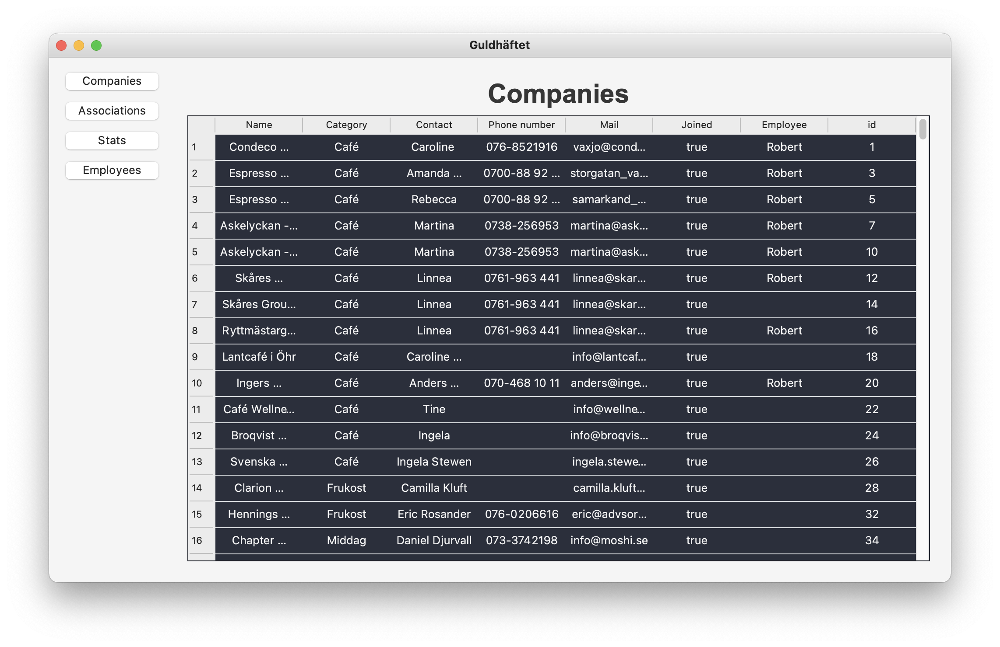
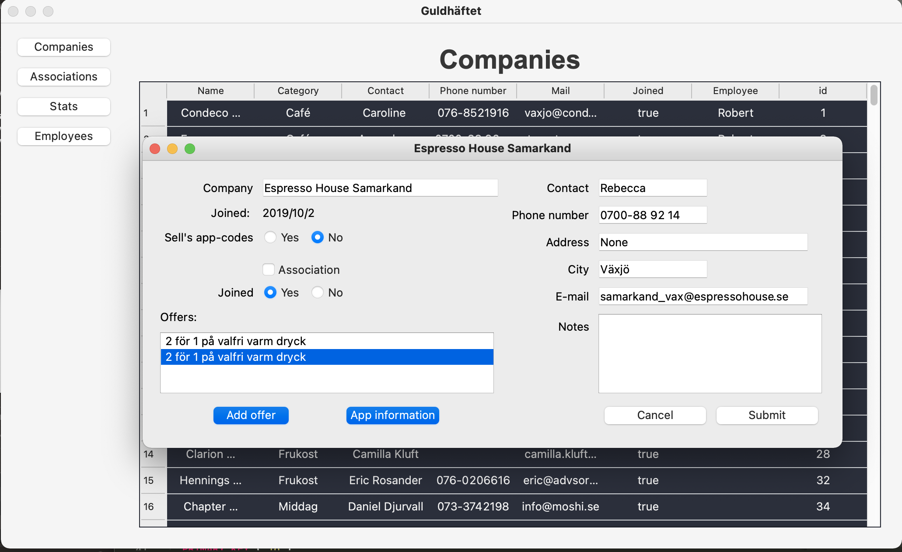
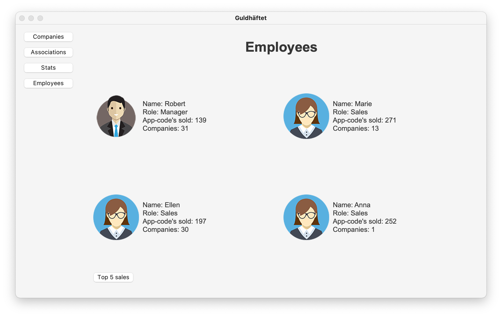

# Administration system with MySQL
This system is built for the course 2DV513 Database Theory. Data is downloaded from a Google Spreadsheet and the inserted into an MySql database. The view for the system is built using **PyQt5**.

### View of the Companies tab

### View of when a company is pressed

### View of the Employees tab
